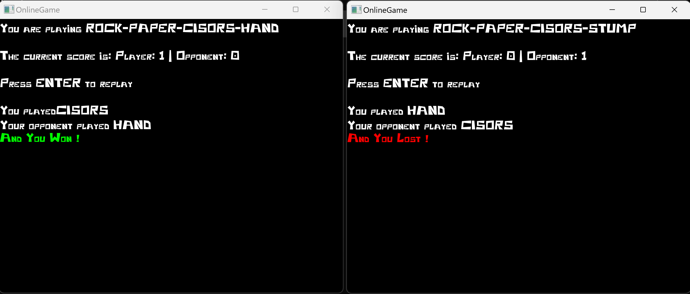
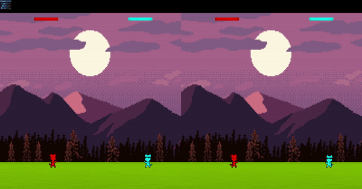

import Button from "../../components/Button.astro";

During my second year of bachelor’s degree in Game Programming, one of the modules we had to study was Networking. 
For that module we had to present a multiplayer game project based on an 
[ECS (entity-component-system)](https://en.wikipedia.org/wiki/Entity_component_system) – 
[Rollback](https://en.wikipedia.org/wiki/Netcode#Rollback) engine in which we implemented [our own physics engine](../projects/physicsengine) done in a previous module.

First, we started with a small **chat** application to learn how networking worked.
For that app, I used [Dear ImGui](https://github.com/ocornut/imgui) for the user 
interface and [SFML](https://www.sfml-dev.org/) to be able to use sockets.

Then we had to do a **turn-based game**. The game I decided to implement was **Rock-Paper-Scissors** but with a funny turn.  

At the end I decided to call the game "Rock-Paper-Scissors-**Hand**" that would transform to "Rock-Paper-Scissors-**Stump**"
if a player used **scissors** **against** a **hand**.

After having fun with that little game, I started implementing **CatFight**.  

You can **read more** or **checkout the repository** on my **Github Page** with the buttons below

    <Button href="https://github.com/SStyles93/SAE921-GPR5100-Network">Access GitHub Page</Button>

    <Button href="/projects/catfight/">Read More</Button>

import {SocialShare} from "astro-social-share";

  <SocialShare
    description={frontmatter.description}
    title={frontmatter.title}
  />

