## Contextualization

During the last year of studies at the SAE-Institute the students of the Games Programming section have to create a game 
in collaboration with the Game Art and Audio Engineering sections. The purpose of the module is to simulate what is, for some, 
a first work experience in a professional-like environment.
One of the roles I inherited was to be the producer for both project. All the process, 
tools used and personal thoughts regarding this role will be exposed and commented throughout this article.

## The projects

### Overview
At the beginning, all the students were teamed up and had to present 8 game pitches to the stakeholders. From these 8 pitches 4 were selected to be improved and presented again. In the end two projects were selected to be produced. For both projects the students had to rework the pitches, create a game design document and a technical document and present them at the beginning of June 2023.

GK Pitch front page | VR Pitch front page
:-----:|:-----:
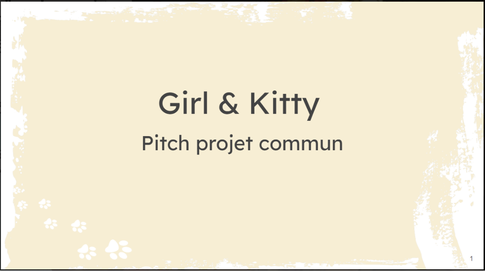 | 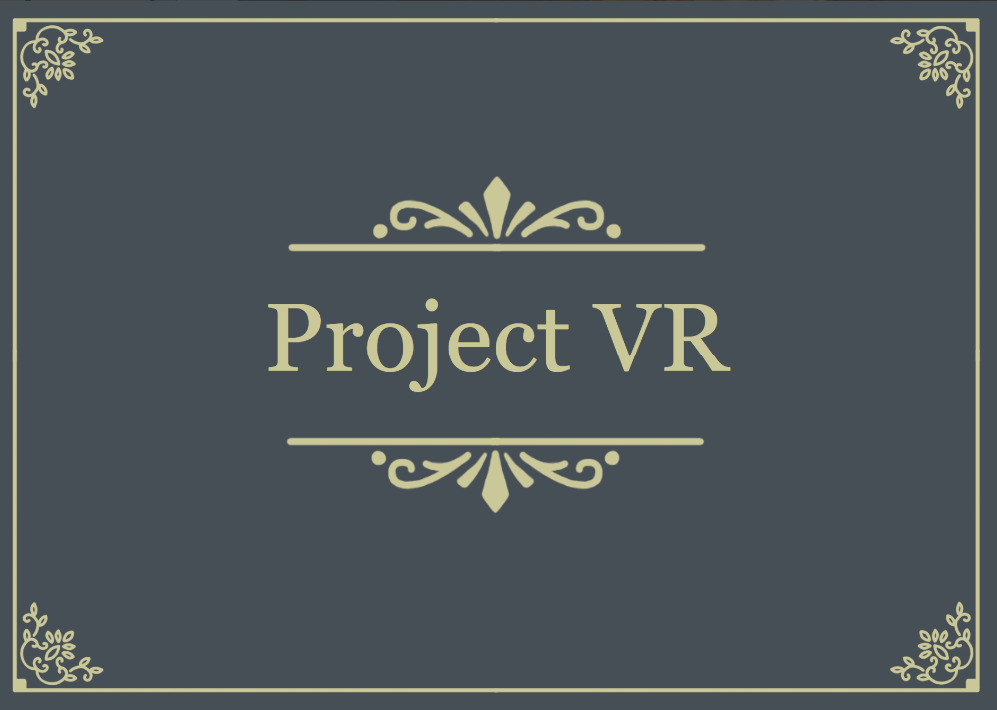 

Once the pitches were presented, two game art students (one per project) were designated to create the 
concept art that would later be used to guide the artistic production. The concept art references and work was 
finished and presented for the beginning of July.

Concept Girl and Kitty | Concept project VR
:-----:|:-----:
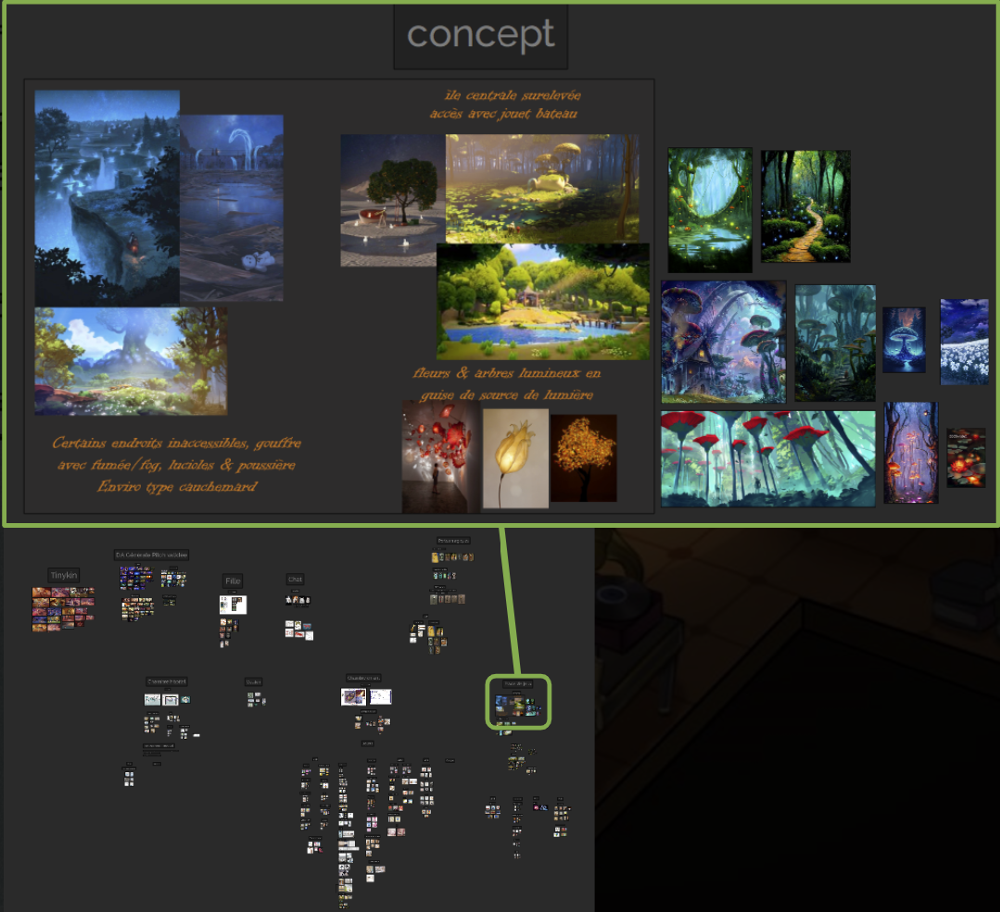 | 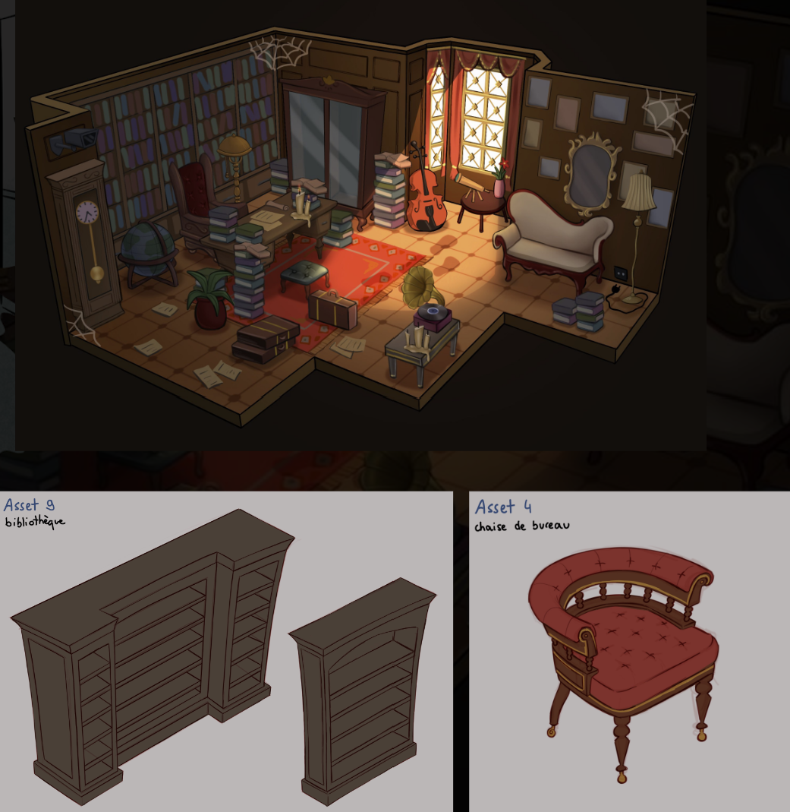

The game design was defined and improved in parallel by the game programmers. Two prototypes were created in parallel.

In september 2023 the head of game programming, [Elias Farhan](https://www.linkedin.com/in/elias-farhan-664373b5/), 
organized a master class with the CEO of [Old Skull Games](https://oldskullgames.com/), 
[Nicolas Brière](https://www.linkedin.com/in/nicolasbriere/), given by 
[William Marié](https://www.linkedin.com/in/william-mari%C3%A9-88ba4112/), a senior executive producer that gave us all 
the tools to achieve our projects with the best setup possible.

From that point and thanks to them, we had all the information necessary to elaborate a project planning from pre-production to release.

### The teams
The first action taken after the master class was to organize the teams and a global hierarchy for the projects. 
The project united the Game Programming, Game Art and Audio Engineering sections. In total we were 31 
without accounting the external people that gave us master classes.  
The organization chart is the following

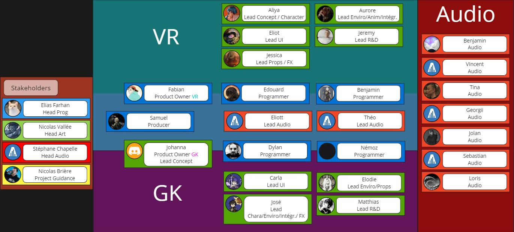

The hierarchy was layed out from left to right. The stakeholders to whom we were accountable are placed on the left. Since I was producer, I was responsible for presenting the work done by the teams to them. Then, for each project, a product owner was nominated per project to follow the work and define the tasks according to the general objectives previously defined. The programmers were dispatched on the two projects according to necessities. The game artists were assigned to one project or the other. For the audio engineering section, we had two leads that would organize and dispatch work for both projects.

## Production tools
This part of the blog is and overview and brief exposition of the tools we used for the game's production, it is categorized by domain.

### Programming tools

#### Unreal Engine 5.3
The game engine we had to use was [Unreal Engine 5.3](https://www.unrealengine.com/en-US/blog/unreal-engine-5-3-is-now-available). The obligation came from Elias Farhan, the head of game programming. Since Unreal is vastly used in the game industry it probably was a wise decision.
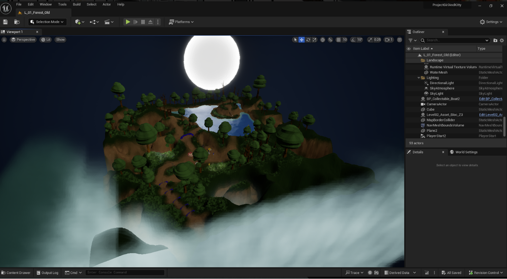 

#### Perforce
Initially we wanted to setup [Perforce](https://www.perforce.com/) for both projects ot be able to work together, 
have version control and be able to lock file and avoid having a destructive workflow or too many merge conflicts.

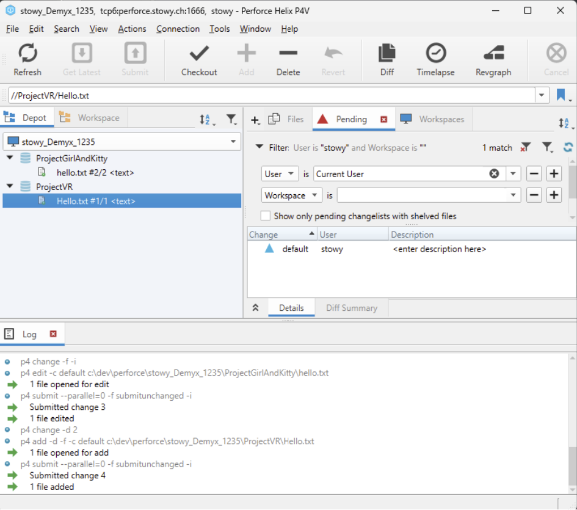 

The problem was that, due to our internet provider, we couldn't set it up and finally installed [GitLab](#gitlab) on a self-hosted server.

#### GitLab

The self-hosting of [GitLab](https://about.gitlab.com/) was done by [Fabian Huber](https://www.fabianhbr.ch/) and the process is
 explained in one of his blogs that you can find [here](https://blog.stowy.ch/posts/devops-specialisation-projects/).
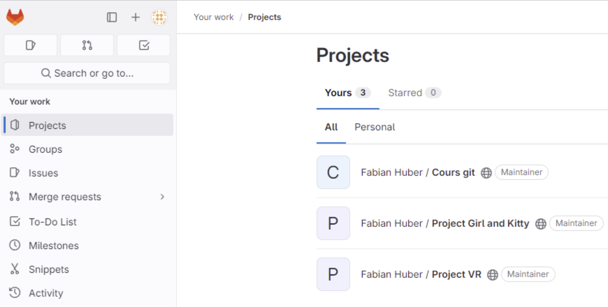 

#### Nextcould
[Nextcloud](https://nextcloud.com/) was used for the team to transfer files, specifically the artists' assets. 
Once again the server was self-hosted and setup by Fabian. The details are explained [here](https://blog.stowy.ch/posts/devops-specialisation-projects/#nextcloud).
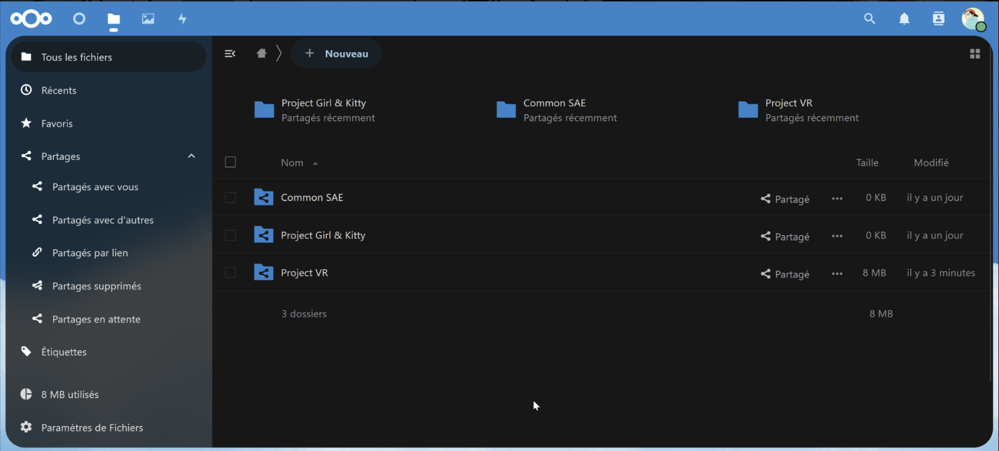 

#### NAS
Since the project was self-hosted, we decided to create a secondary server to backup all the project.
To do so, I setup, with Fabian's help, a [NAS](https://en.wikipedia.org/wiki/Network-attached_storage) using 
a [Raspberry Pi 4 model B](https://www.raspberrypi.com/products/raspberry-pi-4-model-b/) with 4GB 
of [RAM](https://en.wikipedia.org/wiki/Random-access_memory)
and a WesternDigital [My Book Duo](https://www.westerndigital.com/products/external-drives/wd-my-book-duo-usb-3-1-hdd?sku=WDBFBE0160JBK-NESN).
The framework I used was [OpenMediaVault](https://www.openmediavault.org/) and the server was accessed 
by [Styles Studio](https://styles-studio.com/)' s domain name. I also added the [SSH](https://en.wikipedia.org/wiki/Secure_Shell) 
and [SSL](https://en.wikipedia.org/wiki/Transport_Layer_Security#SSL_1.0,_2.0,_and_3.0) protocols to access the server in a more secure way.
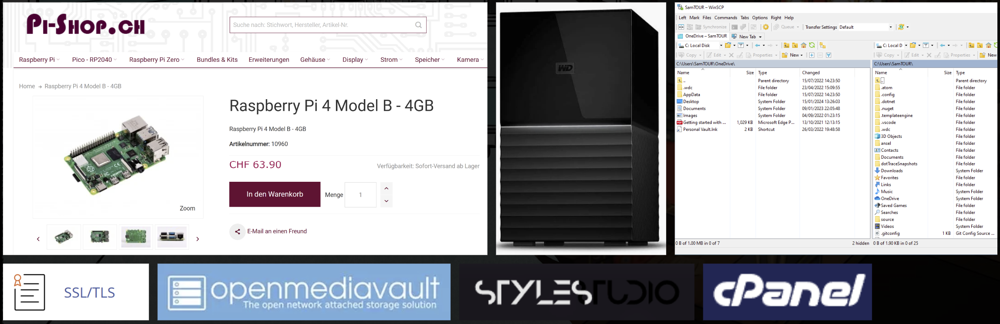 

The last tool used regarding this server was [WinSCP](https://winscp.net/eng/index.php) to manage files in a more user-friendly way.
I also had to create the accounts and everything related to user identification.

Then, Fabian created a script to compress and send files to the NAS with 
a [cronjob](https://kubernetes.io/docs/concepts/workloads/controllers/cron-jobs/). The details of his implementation 
are explained [here](https://blog.stowy.ch/posts/devops-specialisation-projects/#backups).

### Audio tools

#### Pro tools

For the production of sounds, the audio section principally used [Pro tools](https://www.avid.com/pro-tools) and divers sound 
banks or personal recordings.

#### Wwise
To facilitate the integration to UnrealEngine they used [Wwise](https://www.audiokinetic.com/en/products/wwise/) and, since we 
couldn't have perforce, transmitted their work to us with a USB key.

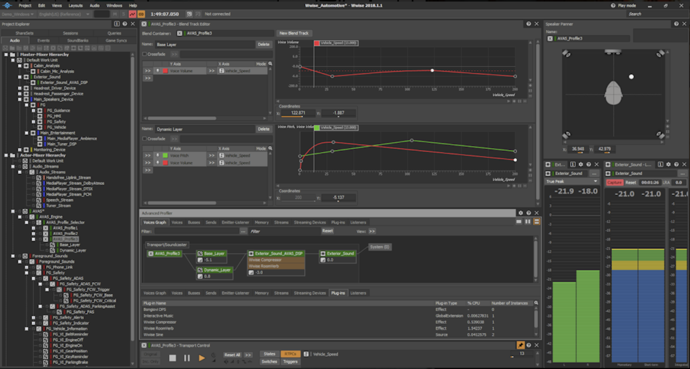 

### Artistic tools

#### 3DS Max & Maya
The tools used by the artists where principally [3DS Max](https://www.autodesk.com/products/3ds-max/overview?term=1-YEAR&tab=subscription) 
and [Maya](https://www.autodesk.com/products/maya/overview?term=1-YEAR&tab=subscription) for 
[Hard Surface modeling](https://www.3ds.com/store/cad/organic-modeling).

3DS Max environment | Maya environment
:-----:|:-----:
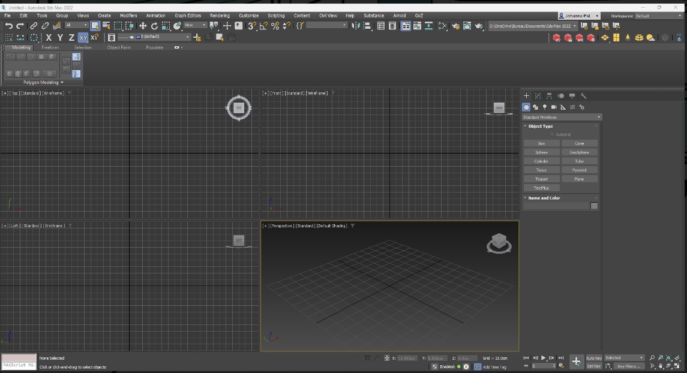 | 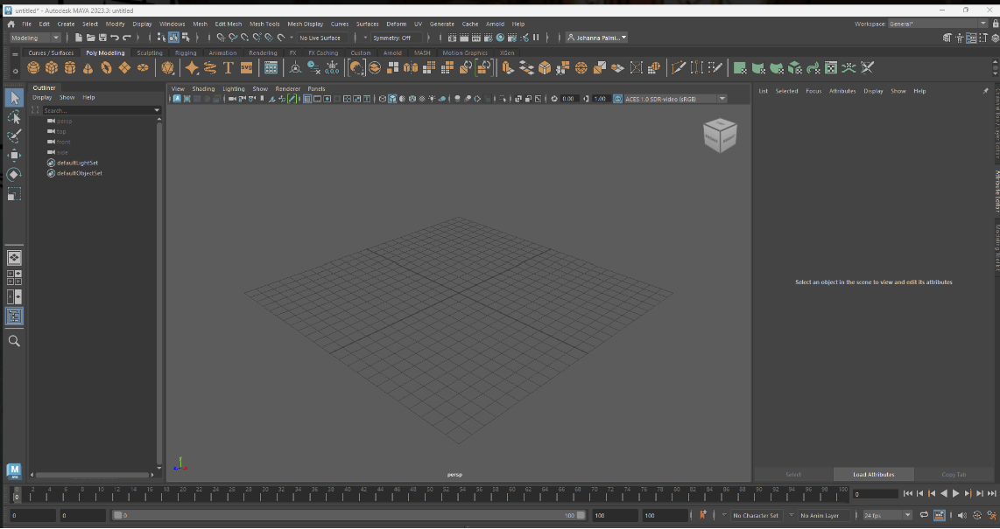

#### ZBrush
In some cases [Zbrush](https://www.maxon.net/en/zbrush) was used for organic modeling or sculpting.

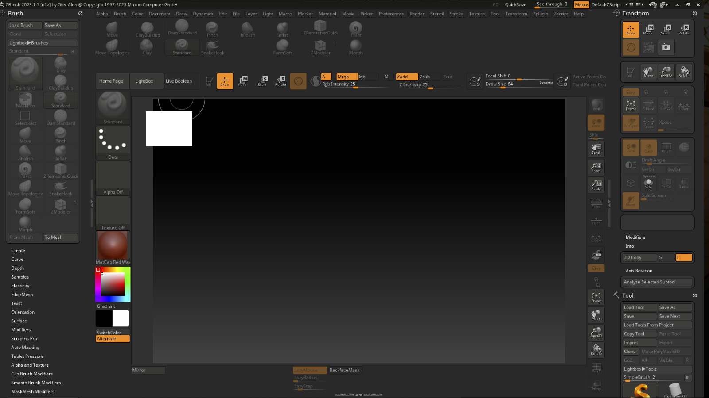 

Some examples of its use was for one of the characters in the project Girl and Kitty

Girl Wireframe | Girl Mesh
:-----:|:-----:
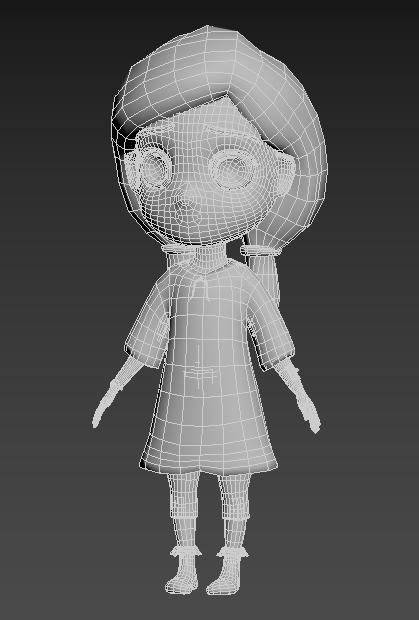 | 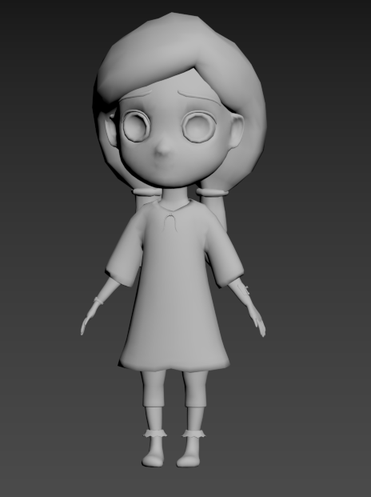

or for one of the humanoid assets the project VR.

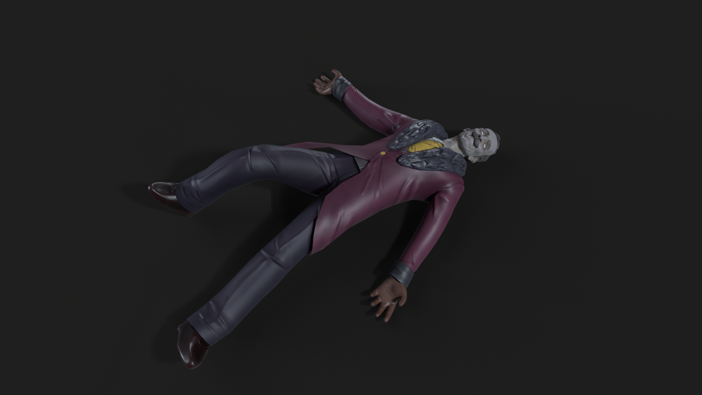

#### Substance Painter & Designer
For the project VR, the artists used [Substance Painter](https://www.adobe.com/products/substance3d-painter.html) and 
[Substance Designer](https://www.adobe.com/products/substance3d-designer.html) to create the textures of their assets.

Substance Painter environment | Substance Designer environment
:-----:|:-----:
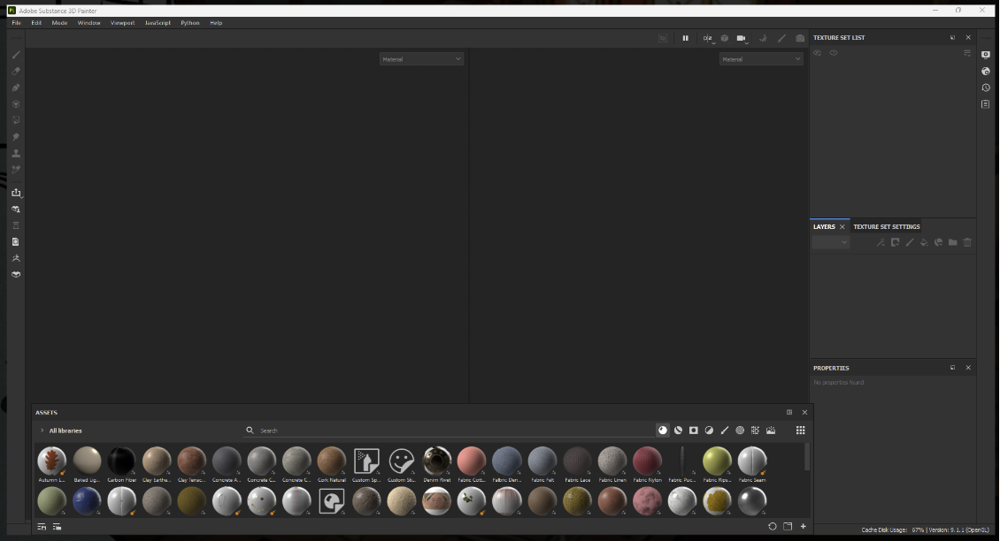 | 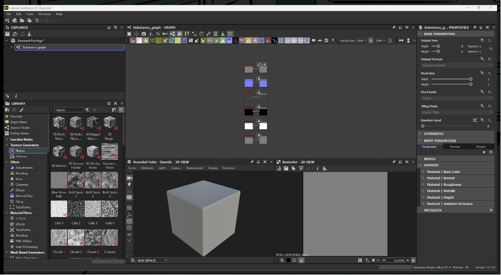

For the project Girl & Kitty, the texturing was done in Unreal Engine 5, for more information about that process you can read 
the blog post made about it [here](https://sstyles93.github.io/blog/posts/UnrealStylizedShaders/#contextualization)

## Organization tools
This part is and overview and exposition of the tools we used for the project's organization.

### Google drive
Since the project was established with approximately 30 people, we had to be able to all access and exchange files. 
For that reason we used Google Drive. Since it was a major "tool" we used, I wanted to expose its structure and content.

#### Weekly
One of the utilities of having a common drive was to store google slides. Since every week I had to present the general 
improvements done on the project, it was useful to be able to store our slides in a common folder. In general the product 
owners or myself were responsible for their creation.

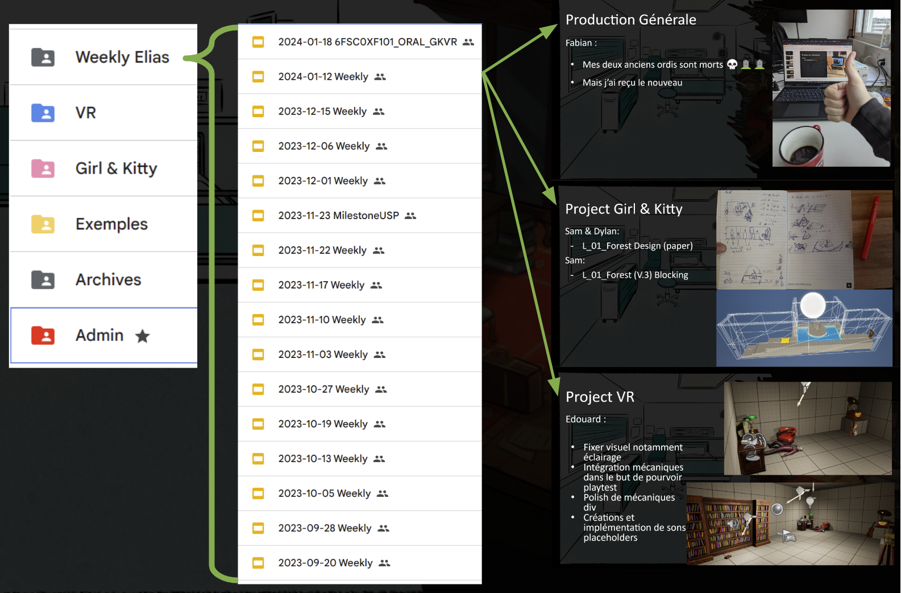

To keep everything as clear a possible our work was always exposed with the same hierarchy: 
General Production, Project Girl and Kitty and then the Project VR. With screenshots and bullet points for every member of the projects.

#### Project folders
Each project had its own folder with diverse documents inside. Going from technical documents to game design, 
these folders contained all the necessary resources created or found by the members.

VR Folder and content | GK Folder and content
:-----:|:-----:
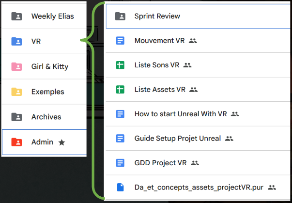 | 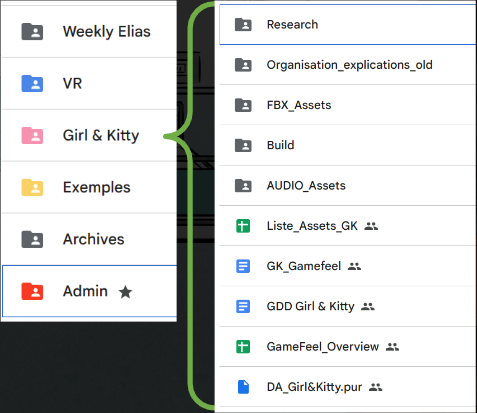

#### Example folder & archives 
These folder contained all the documents received from William Marié to help us organize the production, 
pitch examples we used as references and all documents that were outdated.

Example Folder | Archives Folder
:-----:|:-----:
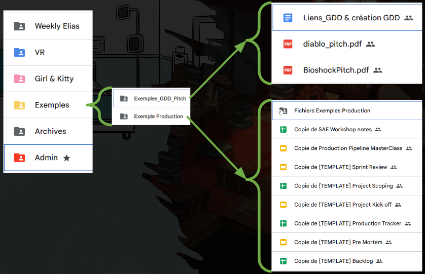 | 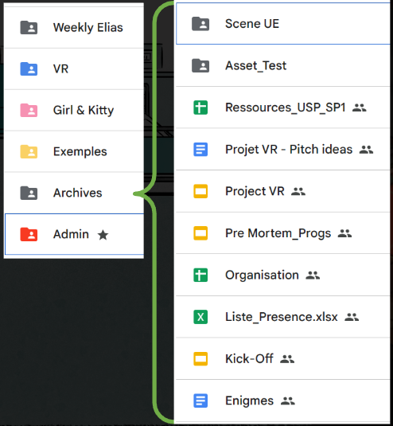

#### Admin folder
This folder was probably the most used by the product owners and myself. It contained all the documents related to the two projects 
and their management.

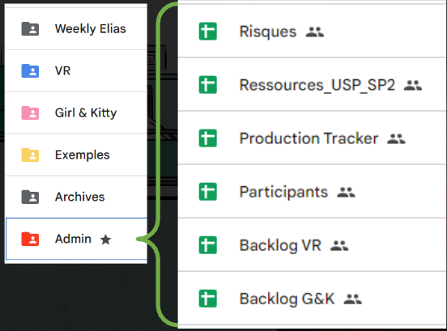

The different documents were the following:
- Risks: Potential problems we could have encountered and the way we could ideally fix them.
- Resources: A spreadsheet where team members could input their availability.
- Production Tracker: Principally use by myself to set the milestones and global tasks.
- Participants: A list of the team members and their contact information.
- Backlog VR and G&K: The task tracker sheets we used to try and improve productivity over time.

### Trello
[Trello](https://trello.com/en) was one of the tools we used as a task tracker. We had three board, one per project and an administrative.

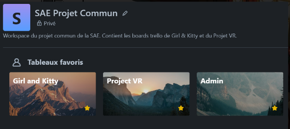

These boards were, at the beginning used by everyone. We had made categories to sort the different stages of work:
- Backlog: The work that was emitted by a product owner but not yet assigned.
- Todo: the task that were assigned and had to be done.
- In Progress: the assigned tasks currently being done.
- Validation: Used for the fulfilled tasks that had to be review by the leads, product owners, producer or heads of department.
- Done: The task that were officially finished

Once the process was done and a task had effectively been validated, it was generally updated on the different 
Backlogs and stored in the Trello archives.

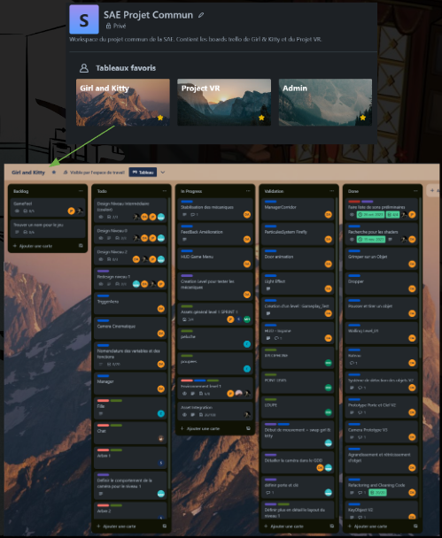

At the beginning we all used trello but in the end, the game artists and sound 
engineers found it more convenient to use an Excels list (see [Project folders](#project-folders)).

### Miro
[Miro](https://miro.com/) was tool we used to design and do brainstorming. We had three boards, one per project and one for administrative work. 

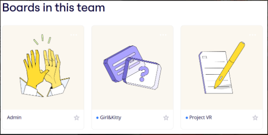

Since it is an online broadcasted whiteboard, we could all work together: draw, write and expose our ideas in a more graphical way.

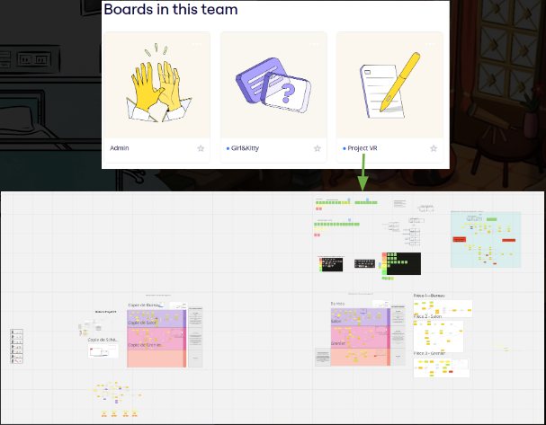

It ended up being really useful when designing the game flow, mechanics and enigma ideas.

### Discord
To communicate on a more daily basis we used [discord](https://discord.com/).

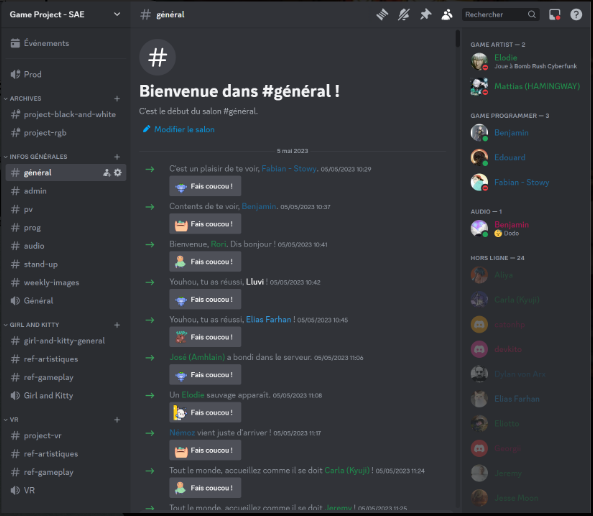

The different canal created where the following:
- General: for general notifications about the projects.
- Administrative: to expose administrative decisions.
- PV: stands for "Procès-Verbal", verbal process, where we posted transcripts of meetings.
- Department canals (prog/audio): for specific information relative to a department.
- stand-up: to keep track of the different action points emitted during project meetings.
- Weekly-images: canal used to expose current state of work and advancement of tasks with a more visual impact.
- General: a vocal canal used for general meetings.

We also had specific canals for each project: general, artistic-refs, gameplay-refs and a vocal room for meetings.

## My role

### Overview
The role itself comprised several tasks, including organizing milestone objectives, reviewing sprint objectives with the 
product owners (PO), preparing and presenting the specific work and overall progress accomplished each week to the stakeholders, 
ensuring productivity, and resolving potential issues, whether they were human or technically related.
These tasks, relatively low in number, took a considerable amount of time and patience.

### Problems Encountered
During the process I encountered multiple problems related to people.
First of all, there were issues with assuming everyone understood things, leading to confusion. 
Another problem was not being clear about why we had organized a hierarchy and tasks in a certain way, causing some 
mix-ups and trouble in the teams. Dealing with conflicts between different departments and within our own teams was tough. 
Managing workloads was challenging, especially when people had other important responsibilities to handle first. 
Making decisions during critical moments was part of the job, but it sometimes disappointed, created tensions among team members and hurt feelings. Feeling like I didn't have enough power due to the hierarchy made me question my role and whether I was taken seriously.
The last problem regarding human interaction was the difficulty to manage time, objectives and tasks with non-responsive people. 
The lack of communication from them resulted in greater delays, work that was unfinished  or hadn’t even been started 
despite the fact that it had been planned. We also suffered from a wave of coronavirus that really didn’t help and reduced productivity too.

Regarding the work, we faced an enormous workload, which was physically and mentally challenging. There were conflicts 
between production and academic planning, causing production problems and a general reduction of performance for all the 
departments. The production plans changed during the process, requiring quick adjustments. Additionally, we had a lack of 
nowledge and practice making some tasks difficult either for myself as a producer or for others in their own roles and endeavors.

Being open about these problems was important. It helped us work together to find solutions and improve the project. 
We discussed these issues openly and tried our best to fix them.
Regarding the production itself, we had issues concerning the infrastructure and available material. 
The main problem was a consequence of a virus introduced in the work environment that resulted in a complete shutdown of 
the internet from the provider and the impossibility to set up servers and exchange work between us, 
thus rendering the communication, work and productivity extremely more intricate.

### What I learned
Through my experiences as a producer, I've learned valuable lessons that I believe are crucial for future projects. 
Firstly, I learned not to underestimate the importance of ensuring that everyone truly understands the information. 
Assuming universal understanding can lead to confusion, so it's essential to take the time to ensure clarity.

Clear communication emerged as a powerful tool in project management. 
I discovered that being crystal clear about why tasks are organized in a certain way can prevent misunderstandings 
and improve teamwork. It definitely is a lesson on the impact of effective communication on a project’s success.

Another important realization is that the role of a producer is a full-time commitment. The time and dedication 
required for this role should not be underestimated or neglected. The responsibilities, from managing conflicts 
to making critical decisions, demand consistent attention and effort.

Furthermore, I learned that effective communication, while crucial, can be time-consuming, sometimes surpassing initial expectations. 
Acknowledging and planning for the time investment in communication is vital for realistic project management. 
These insights have equipped me with a more nuanced understanding of the producer's role and the key factors that contribute 
to successful project outcomes.

## Conclusion
In terms of experience, navigating the role of a producer proved to be a challenging yet immensely rewarding journey. 
Despite grappling with a multitude of complexities and encountering more than our fair share of obstacles throughout the 
production process, the ultimate outcome surprisingly surpassed expectations given the circumstances. 
The demanding nature of the role often felt like an emotional rollercoaster, where stress and challenges 
became an integral part of the daily routine. However, the satisfaction derived from overcoming hurdles and 
witnessing the project come to life added a unique layer to the overall experience, making it a valuable and character-building endeavor."
